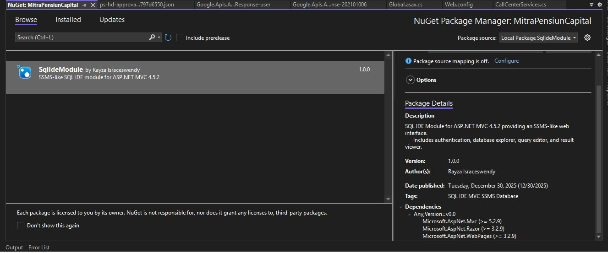
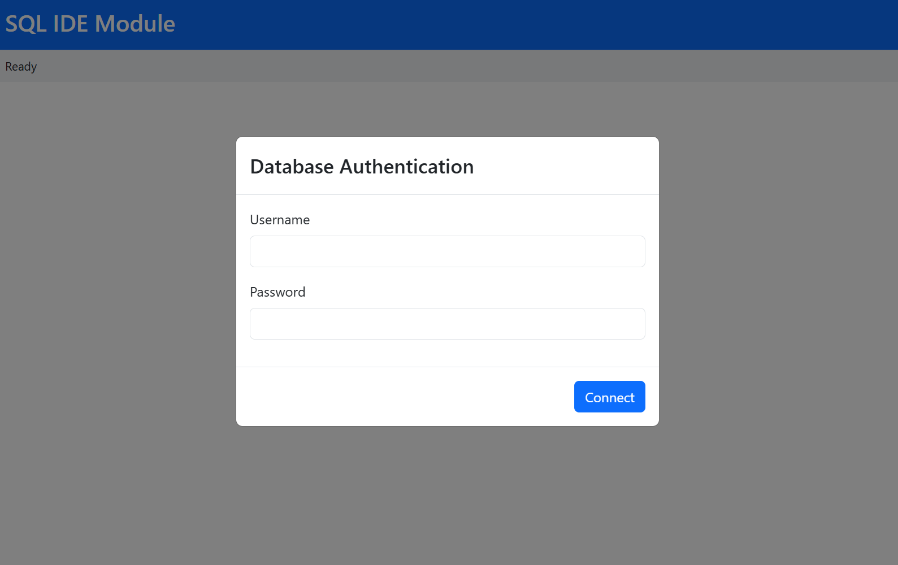
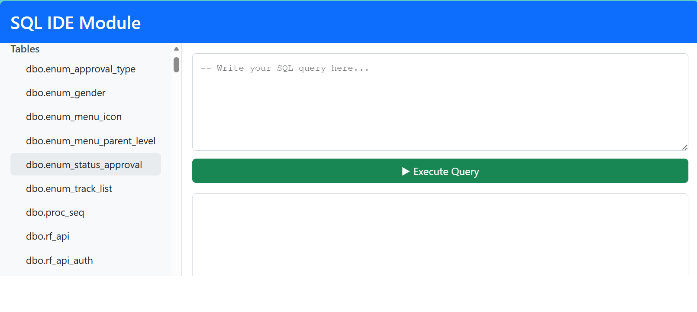
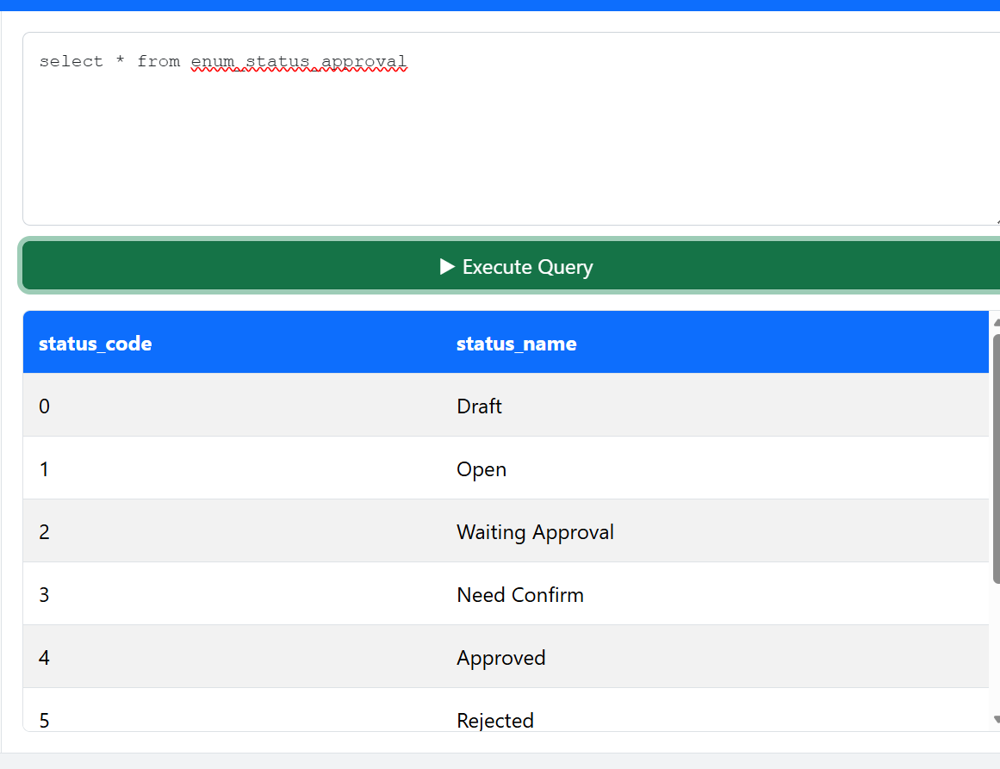
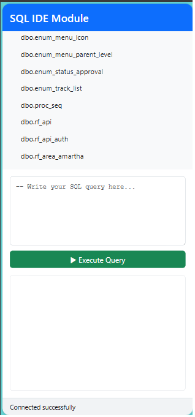

# 🚀 SQL IDE Module for ASP.NET MVC

[](https://www.nuget.org/)
[](https://dotnet.microsoft.com/)
[](LICENSE)

> A powerful, embeddable SQL IDE for ASP.NET MVC applications - Bring SQL Server Management Studio capabilities directly into your web application!


---

## 📋 Table of Contents

- [Overview](#-overview)
- [Key Features](#-key-features)
- [Why Choose SQL IDE Module?](#-why-choose-sql-ide-module)
- [Screenshots](#-screenshots)
- [Installation](#-installation)
- [Quick Start](#-quick-start)
- [Configuration](#-configuration)
- [Usage](#-usage)
- [Security](#-security)
- [Architecture](#-architecture)
- [Browser Support](#-browser-support)
- [Contributing](#-contributing)
- [License](#-license)
- [Support](#-support)

---

## 🎯 Overview

**SQL IDE Module** is a lightweight, production-ready NuGet package that adds a fully functional SQL query interface to your ASP.NET MVC 4.5.2+ applications. Built with security and performance in mind, it provides developers and administrators with instant database access without leaving your application.

### What Makes It Special?

- 🔌 **Zero Configuration** - Install via NuGet and start querying in minutes
- 🎨 **SSMS-Like Experience** - Familiar interface for SQL Server users
- 🔒 **Enterprise-Grade Security** - Built-in authentication and query restrictions
- ⚡ **High Performance** - Optimized for large datasets with smart result limiting
- 📱 **Responsive Design** - Works seamlessly on desktop, tablet, and mobile
- 🛠️ **Flexible Integration** - Supports multiple connection string strategies

---

## ✨ Key Features

### 🗂️ Database Explorer
- **Visual Schema Browser** - Navigate tables, views, stored procedures, and functions
- **One-Click Definition Loading** - Click any object to load its definition into the editor
- **Collapsible Sidebar** - Maximize screen space when needed
- **Real-Time Metadata** - Always shows current database structure

### 📝 Query Editor
- **Multi-Line SQL Editor** - Comfortable editing environment with monospace font
- **Keyboard Shortcuts** - F5 to execute, just like SSMS
- **Query Formatting** - Built-in SQL formatter for cleaner code
- **Smart Validation** - Client-side validation before execution

### 📊 Results Viewer
- **Grid Display** - Clean, sortable table view of results
- **Horizontal Scrolling** - Never lose columns on wide result sets
- **Sticky Headers** - Column names stay visible while scrolling
- **NULL Handling** - Clear visual indicators for NULL values
- **Performance Metrics** - Execution time and row count displayed

### 🔐 Security & Safety
- **SQL Authentication** - Validates credentials against the database
- **Query Restrictions** - Blocks dangerous commands (DROP, DELETE, TRUNCATE, etc.)
- **Result Limiting** - Automatic 1000-row limit prevents browser crashes
- **Session Management** - Secure session-based authentication
- **Timeout Protection** - 30-second query timeout

### 🎨 User Experience
- **Modern UI** - Clean, Bootstrap-based interface
- **Loading Indicators** - Visual feedback during operations
- **Error Handling** - Clear, actionable error messages
- **Status Bar** - Real-time operation status and statistics
- **Responsive Layout** - Adapts to any screen size

### ⚙️ Configuration Flexibility
- **Web.config Support** - Traditional connection string configuration
- **Custom Builders** - Integrate with existing connection logic
- **Environment-Aware** - Easy production/development switching
- **Multiple Databases** - Support for various connection strategies

---

## 🏆 Why Choose SQL IDE Module?

| Feature | SQL IDE Module | Alternative Solutions |
|---------|----------------|----------------------|
| **Installation Time** | < 5 minutes | Hours of development |
| **Learning Curve** | None (SSMS-like) | Application-specific |
| **Mobile Support** | ✅ Built-in | ❌ Usually desktop only |
| **Security** | ✅ Production-ready | ⚠️ Requires custom implementation |
| **Cost** | 🆓 Free & Open Source | 💰 Expensive or time-consuming |
| **Maintenance** | ✅ Package updates | ❌ Your responsibility |
| **Result Limiting** | ✅ Automatic | ⚠️ Manual implementation needed |
| **Custom Integration** | ✅ Flexible providers | ❌ Fixed configuration |

---

## 📸 Screenshots

### Installation 


### Authentication Modal


*Secure database authentication with clear error handling*

### Database Explorer & Query Editor


*SSMS-like split view with collapsible sidebar and modern editor*

### Query Results


*Clean grid display with horizontal scrolling and sticky headers*

### Mobile Responsive


*Fully functional on mobile devices*

---

## 📦 Installation

### Prerequisites
- ASP.NET MVC 4.5.2 or higher
- SQL Server (any version)
- Visual Studio 2017+ or Visual Studio 2022

### Install via NuGet Package Manager Console

```powershell
Install-Package SqlIdeModule
```

### Install via NuGet Package Manager UI

1. Right-click your project → **Manage NuGet Packages**
2. Search for `SqlIdeModule`
3. Click **Install**

### Install from Local Source (Development)

```powershell
Install-Package SqlIdeModule -Source "C:\path\to\package\folder"
```

---

## 🚀 Quick Start

### 1. Configure Connection String

Add to your `Global.asax.cs`:

```csharp
using SqlIdeModule.Web.Configuration;

protected void Application_Start()
{
    AreaRegistration.RegisterAllAreas();
    
    // Option 1: Use Web.config connection string
    SqlIdeConfiguration.UseWebConfig("DefaultConnection");
    
    // Option 2: Use custom connection builder (recommended for enterprise apps)
    // SqlIdeConfiguration.UseCustomConnectionString(() => 
    //     YourNamespace.ConnectionStringBuilder.Construct()
    // );
}
```

### 2. Add Web.config Connection String (if using Option 1)

```xml
<connectionStrings>
  <add name="DefaultConnection" 
       connectionString="Server=localhost;Database=YourDB;User Id=sa;Password=yourpass;" 
       providerName="System.Data.SqlClient" />
</connectionStrings>
```

### 3. Add Navigation Link (Optional)

In your `_Layout.cshtml`:

```html
<li>@Html.ActionLink("SQL IDE", "Index", "SqlIde", new { area = "SqlIde" }, null)</li>
```

### 4. Access the SQL IDE

Navigate to: `http://localhost:port/SqlIde/SqlIde`

**That's it!** 🎉 You're ready to start querying!

---

## ⚙️ Configuration

### Configuration Options

The SQL IDE Module supports three connection string strategies:

#### Option 1: Web.config (Simple)

Best for: Small applications, quick prototypes

```csharp
// Global.asax.cs
SqlIdeConfiguration.UseWebConfig("DefaultConnection");
```

#### Option 2: Custom Connection Builder (Enterprise)

Best for: Production applications with environment-specific logic

```csharp
// Global.asax.cs
SqlIdeConfiguration.UseCustomConnectionString(() => 
    MyApp.Database.ConnectionStringBuilder.Construct()
);
```

**Example Custom Builder:**
```csharp
public class ConnectionStringBuilder
{
    public static string Construct()
    {
        bool isProd = Convert.ToBoolean(ConfigurationManager.AppSettings["isProd"]);
        
        var builder = new SqlConnectionStringBuilder
        {
            UserID = isProd ? "prod_user" : "dev_user",
            Password = isProd ? "prod_pass" : "dev_pass",
            InitialCatalog = isProd ? "ProductionDB" : "DevelopmentDB",
            DataSource = isProd ? "prod-server" : "dev-server"
        };
        
        return builder.ConnectionString;
    }
}
```

#### Option 3: Static Connection String (Testing)

Best for: Unit tests, demo environments

```csharp
// Global.asax.cs
SqlIdeConfiguration.UseStaticConnectionString(
    "Server=localhost;Database=TestDB;User Id=test;Password=test123;"
);
```

### Advanced Configuration

#### Customize Row Limit

Edit `SqlExecutionService.cs`:

```csharp
private readonly int _maxRows = 1000; // Change to your preferred limit
```

#### Modify Query Timeout

Edit `SqlExecutionService.cs`:

```csharp
private readonly int _commandTimeout = 30; // Seconds
```

#### Enable/Disable Dangerous Commands

Edit the `ContainsDangerousCommand` method in `SqlExecutionService.cs`:

```csharp
var dangerous = new[] { "DROP ", "TRUNCATE ", "DELETE ", "ALTER " }; // Customize list
```

---

## 📖 Usage

### Basic Query Execution

1. **Login** - Enter SQL Server username and password
2. **Browse** - Explore database objects in the left panel
3. **Write** - Type your SQL query in the editor
4. **Execute** - Press F5 or click "Execute Query"
5. **View** - Results appear in the grid below

### Keyboard Shortcuts

| Shortcut | Action |
|----------|--------|
| **F5** | Execute current query |
| **Ctrl+Enter** | Execute query (alternative) |
| **Esc** | Clear editor |

### Tips & Tricks

#### 1. Loading Object Definitions
Click any view, stored procedure, or function in the database explorer to load its definition.

#### 2. Managing Large Result Sets
Always use `TOP n` or `WHERE` clauses to limit results:
```sql
SELECT TOP 100 * FROM LargeTable WHERE CreatedDate >= '2024-01-01'
```

#### 3. Formatting Queries
Click the "Format" button to auto-format your SQL for better readability.

#### 4. Collapsing Sidebar
Click the arrow button on the left panel to maximize editor space.

#### 5. Viewing Long Text
Hover over table cells to see tooltips with full content.

---

## 🔒 Security

### Built-In Security Features

✅ **SQL Authentication** - Validates credentials before granting access  
✅ **Query Restrictions** - Blocks DROP, DELETE, TRUNCATE, ALTER commands  
✅ **Result Limiting** - Prevents excessive data retrieval  
✅ **Session-Based Auth** - No persistent credentials storage  
✅ **Timeout Protection** - Prevents long-running queries  
✅ **SQL Injection Prevention** - Parameterized queries where applicable

### Production Security Recommendations

#### 1. Role-Based Access Control

Create a custom controller that inherits from `SqlIdeController`:

```csharp
using System.Web.Mvc;
using SqlIdeModule.Web.Areas.SqlIde.Controllers;

namespace YourApp.Areas.SqlIde.Controllers
{
    [Authorize(Roles = "Administrator,Developer")]
    public class SecureSqlIdeController : SqlIdeController
    {
        // Inherits all functionality with added authorization
    }
}
```

Update your route to use the secure controller in `RouteConfig.cs`.

#### 2. IP Whitelisting

Add to `Web.config`:

```xml
<location path="SqlIde">
  <system.webServer>
    <security>
      <ipSecurity allowUnlisted="false">
        <add ipAddress="192.168.1.100" allowed="true" />
        <add ipAddress="10.0.0.0" subnetMask="255.255.255.0" allowed="true" />
      </ipSecurity>
    </security>
  </system.webServer>
</location>
```

#### 3. Environment-Based Disabling

```xml
<!-- Web.config -->
<appSettings>
  <add key="SqlIdeEnabled" value="false" /> <!-- false in production -->
</appSettings>
```

```csharp
// Global.asax.cs
protected void Application_Start()
{
    AreaRegistration.RegisterAllAreas();
    
    bool sqlIdeEnabled = Convert.ToBoolean(
        ConfigurationManager.AppSettings["SqlIdeEnabled"] ?? "false"
    );
    
    if (sqlIdeEnabled)
    {
        SqlIdeConfiguration.UseCustomConnectionString(() => 
            ConnectionStringBuilder.Construct()
        );
    }
}
```

#### 4. Read-Only Database User

Create a dedicated read-only SQL user:

```sql
CREATE LOGIN sqlide_readonly WITH PASSWORD = 'SecurePassword123!';
CREATE USER sqlide_readonly FOR LOGIN sqlide_readonly;

-- Grant read-only access
GRANT SELECT ON SCHEMA::dbo TO sqlide_readonly;
GRANT VIEW DEFINITION ON SCHEMA::dbo TO sqlide_readonly;
```

Use this user for SQL IDE authentication in production.

#### 5. Audit Logging

Track all queries by modifying `ExecuteQuery` in `SqlIdeController.cs`:

```csharp
// Log query execution
Logger.Info($"User {User.Identity.Name} executed: {query}");
```

---

## 🏗️ Architecture

### Project Structure

```
SqlIdeModule/
├── SqlIdeModule.Core/              # Business logic layer
│   ├── Models/                     # Data models
│   │   ├── SqlCredentials.cs
│   │   ├── AuthenticationResult.cs
│   │   ├── DatabaseObject.cs
│   │   └── QueryResult.cs
│   └── Services/                   # Core services
│       ├── IAuthenticationService.cs
│       ├── AuthenticationService.cs
│       ├── IDatabaseExplorerService.cs
│       ├── DatabaseExplorerService.cs
│       ├── ISqlExecutionService.cs
│       ├── SqlExecutionService.cs
│       ├── IConnectionStringProvider.cs
│       ├── ConfigConnectionStringProvider.cs
│       └── CustomConnectionStringProvider.cs
│
├── SqlIdeModule.Web/               # Web layer (MVC Area)
│   ├── Areas/
│   │   └── SqlIde/
│   │       ├── Controllers/
│   │       │   └── SqlIdeController.cs
│   │       ├── Views/
│   │       │   ├── Web.config
│   │       │   └── SqlIde/
│   │       │       └── Index.cshtml
│   │       └── SqlIdeAreaRegistration.cs
│   ├── Configuration/
│   │   └── SqlIdeConfiguration.cs  # Static configuration
│   ├── tools/
│   │   └── install.ps1             # NuGet install script
│   └── SqlIdeModule.nuspec         # NuGet package definition
│
└── SqlIdeModule.Sample/            # Demo/test application
    └── ...
```

### Technology Stack

| Layer | Technology |
|-------|-----------|
| **Frontend** | Bootstrap 3.3.7, jQuery 1.12.4, Font Awesome 4.7 |
| **Backend** | ASP.NET MVC 5.2.3, C# |
| **Data Access** | ADO.NET, Entity Framework 6.1.3 |
| **Database** | SQL Server (any version) |
| **Architecture** | MVC Areas, Repository Pattern, Dependency Injection Ready |

### Design Patterns

- **Repository Pattern** - Clean separation of data access
- **Strategy Pattern** - Flexible connection string providers
- **Factory Pattern** - Service instantiation
- **MVC Pattern** - Standard ASP.NET MVC architecture

---

## 🌐 Browser Support

| Browser | Version | Status |
|---------|---------|--------|
| Chrome | Latest | ✅ Fully Supported |
| Firefox | Latest | ✅ Fully Supported |
| Edge | Latest | ✅ Fully Supported |
| Safari | 10+ | ✅ Fully Supported |
| IE | 11 | ⚠️ Partial Support* |

*Internet Explorer 11: Core functionality works, but some modern CSS features may not render perfectly.

---

## 🤝 Contributing

We welcome contributions! Here's how you can help:

### Reporting Bugs

1. Check if the bug has already been reported
2. Create a new issue with:
   - Clear title and description
   - Steps to reproduce
   - Expected vs actual behavior
   - Screenshots if applicable
   - Environment details (OS, browser, .NET version)

### Suggesting Features

1. Open an issue with the `enhancement` label
2. Describe the feature and use case
3. Explain why it would be beneficial

### Pull Requests

1. Fork the repository
2. Create a feature branch: `git checkout -b feature/amazing-feature`
3. Commit your changes: `git commit -m 'Add amazing feature'`
4. Push to the branch: `git push origin feature/amazing-feature`
5. Open a Pull Request

### Development Setup

```bash
# Clone the repository
git clone https://github.com/yourusername/SqlIdeModule.git

# Open in Visual Studio
cd SqlIdeModule
start SqlIdeModule.sln

# Restore NuGet packages
nuget restore

# Build solution
msbuild SqlIdeModule.sln /p:Configuration=Release

# Run tests (if you add them)
dotnet test
```

---

## 📄 License

This project is licensed under the MIT License - see the [LICENSE](LICENSE) file for details.

```
MIT License

Copyright (c) 2024 [Your Name]

Permission is hereby granted, free of charge, to any person obtaining a copy
of this software and associated documentation files (the "Software"), to deal
in the Software without restriction, including without limitation the rights
to use, copy, modify, merge, publish, distribute, sublicense, and/or sell
copies of the Software, and to permit persons to whom the Software is
furnished to do so, subject to the following conditions:

The above copyright notice and this permission notice shall be included in all
copies or substantial portions of the Software.

THE SOFTWARE IS PROVIDED "AS IS", WITHOUT WARRANTY OF ANY KIND, EXPRESS OR
IMPLIED, INCLUDING BUT NOT LIMITED TO THE WARRANTIES OF MERCHANTABILITY,
FITNESS FOR A PARTICULAR PURPOSE AND NONINFRINGEMENT. IN NO EVENT SHALL THE
AUTHORS OR COPYRIGHT HOLDERS BE LIABLE FOR ANY CLAIM, DAMAGES OR OTHER
LIABILITY, WHETHER IN AN ACTION OF CONTRACT, TORT OR OTHERWISE, ARISING FROM,
OUT OF OR IN CONNECTION WITH THE SOFTWARE OR THE USE OR OTHER DEALINGS IN THE
SOFTWARE.
```

---

## 💬 Support

### Documentation
- [Installation Guide](docs/installation.md)
- [Configuration Guide](docs/configuration.md)
- [API Reference](docs/api-reference.md)
- [FAQ](docs/faq.md)

### Community
- 🐛 **Bug Reports**: [GitHub Issues](https://github.com/yourusername/SqlIdeModule/issues)
- 💡 **Feature Requests**: [GitHub Issues](https://github.com/yourusername/SqlIdeModule/issues)
- 💬 **Discussions**: [GitHub Discussions](https://github.com/yourusername/SqlIdeModule/discussions)

### Contact
- 📧 Email: your.email@example.com
- 🐦 Twitter: [@yourhandle](https://twitter.com/yourhandle)
- 💼 LinkedIn: [Your Name](https://linkedin.com/in/yourprofile)

---

## 🎖️ Acknowledgments

- Inspired by SQL Server Management Studio
- Built with love for the ASP.NET MVC community
- Thanks to all contributors and users!

---

## 🗺️ Roadmap

### Version 1.1 (Planned)
- [ ] Query history
- [ ] Export to CSV/Excel
- [ ] Syntax highlighting with CodeMirror
- [ ] Query templates/snippets
- [ ] Dark mode theme

### Version 1.2 (Future)
- [ ] Multiple query tabs
- [ ] SQL autocomplete
- [ ] Execution plan viewer
- [ ] Database comparison tool
- [ ] Scheduled query execution

### Version 2.0 (Vision)
- [ ] Support for MySQL, PostgreSQL
- [ ] Visual query builder
- [ ] Real-time collaboration
- [ ] Cloud deployment support
- [ ] REST API for external integrations

---

## 📊 Statistics


---

<div align="center">

**[⬆ Back to Top](#-sql-ide-module-for-aspnet-mvc)**

Made with ❤️ by developers, for developers

**Star ⭐ this repository if you find it helpful!**

</div>